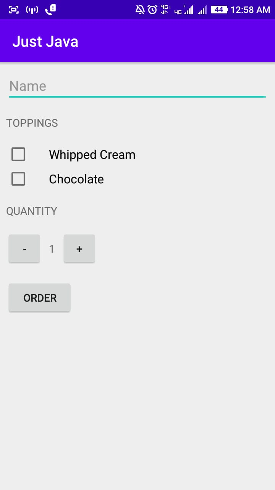
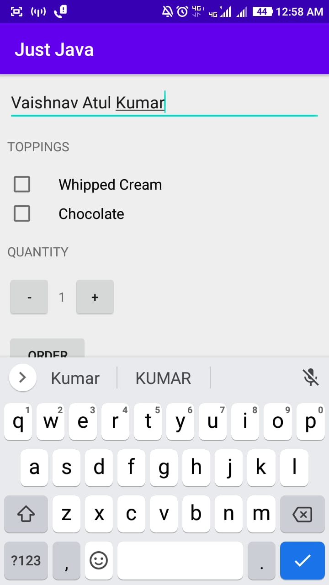
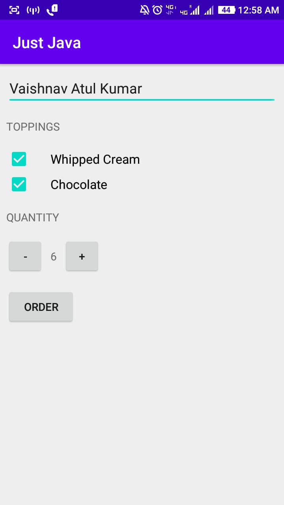
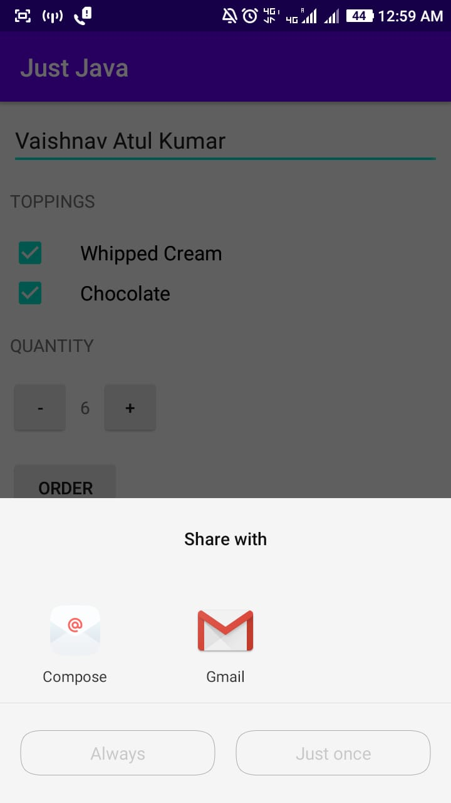
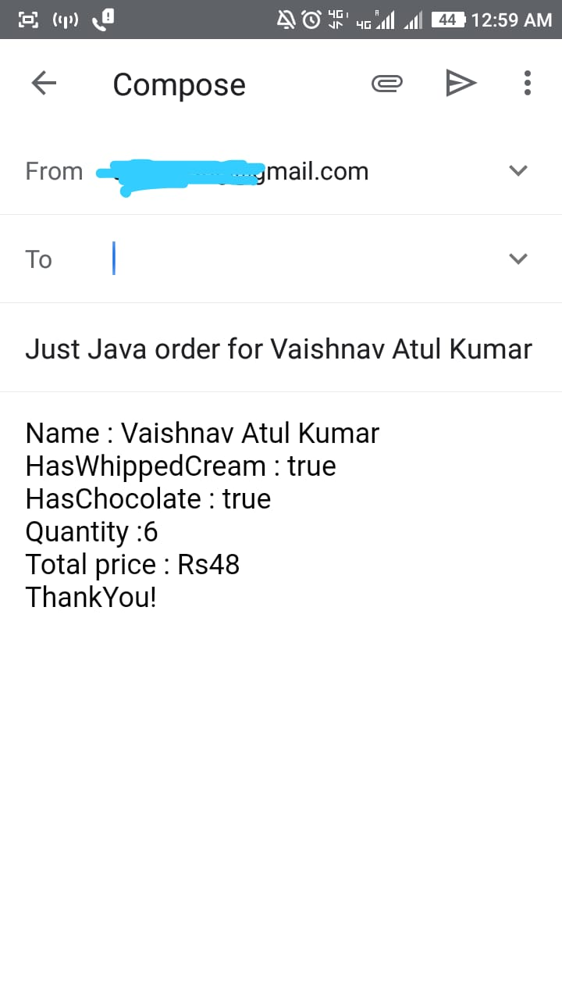

# JustJava
 This app helps you to order coffee via Email.
 This app uses Explicit Intents to open third party email apps to sent an email with your coffee order.
 This app also taught me - about EditText views which helped me take user's name as input.Checkboxes are used to take few more inputs.

 Here are few screenshots of the app

    
